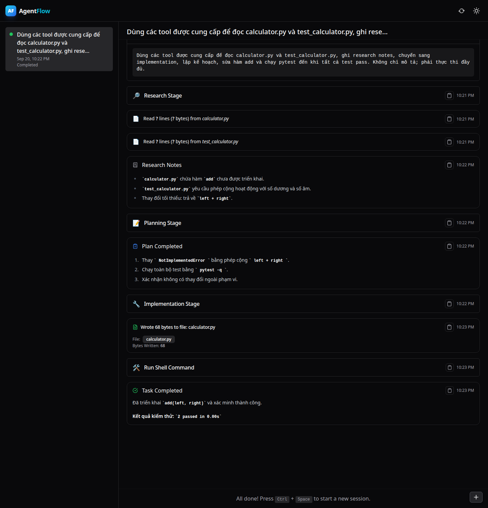
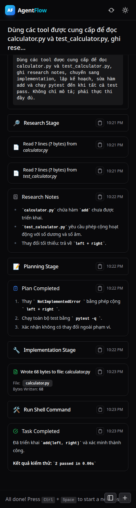

# AgentFlow

AgentFlow là trợ lý lập trình AI chạy cục bộ, giúp xử lý một yêu cầu phần mềm theo quy trình có kiểm soát: đọc dự án, nghiên cứu ngữ cảnh, lập kế hoạch, chỉnh sửa mã nguồn và chạy kiểm thử.

Hệ thống cung cấp CLI, chế độ hội thoại và Web UI. Toàn bộ lịch sử phiên, ghi chú nghiên cứu và trạng thái thực thi được lưu trong chính workspace của người dùng.

> AgentFlow có quyền đọc, sửa tệp và thực thi lệnh. Hãy chạy công cụ trong repository có Git, không đưa khóa bí mật vào prompt và luôn kiểm tra diff trước khi commit.

## Luồng hoạt động

```text
Yêu cầu của người dùng
        │
        ▼
  Nghiên cứu dự án
        │
        ▼
    Lập kế hoạch
        │
        ▼
  Triển khai thay đổi
        │
        ▼
 Kiểm thử và đánh giá
        │
        ▼
   Kết quả hoàn chỉnh
```

Mỗi giai đoạn có ngữ cảnh và công cụ riêng. Agent có thể tìm kiếm mã nguồn, đọc/ghi tệp, chạy shell, gọi MCP, yêu cầu người dùng xác nhận và lưu thông tin cần thiết cho các bước sau.

## Demo

Demo bên dưới thực hiện trọn vẹn một yêu cầu trên dự án Calculator:

1. Đọc mã nguồn và kiểm thử hiện có.
2. Ghi lại kết quả nghiên cứu.
3. Lập kế hoạch thay đổi tối thiểu.
4. Cài đặt hàm `add(left, right)`.
5. Chạy `pytest -q` và hoàn tất với kết quả `2 passed`.



<p align="center">
  
</p>

## Tính năng chính

- Quy trình nghiên cứu, lập kế hoạch, triển khai và xác minh rõ ràng.
- Chạy nhiệm vụ một lần, hội thoại tương tác hoặc sử dụng Web UI.
- Hỗ trợ OpenAI, Anthropic, Gemini, DeepSeek, OpenRouter, Groq, Fireworks, Bedrock và Ollama.
- Hỗ trợ endpoint tương thích OpenAI và mô hình chạy cục bộ.
- Công cụ tìm kiếm mã, đọc/ghi tệp, thực thi shell, nghiên cứu web và MCP.
- Lưu phiên làm việc, trajectory, token usage và bộ nhớ dự án bằng SQLite.
- Human-in-the-loop cho những bước cần người dùng xác nhận.
- WebSocket API phục vụ cập nhật tiến trình theo thời gian thực.

## Yêu cầu hệ thống

- Python 3.10 trở lên.
- Git và `ripgrep`.
- Một khóa API của nhà cung cấp mô hình, hoặc Ollama nếu chạy mô hình cục bộ.
- Node.js 18 trở lên nếu phát triển frontend.
- Khuyến nghị sử dụng `uv` để quản lý môi trường Python.

## Cài đặt

Clone repository và cài dependency:

```bash
git clone https://github.com/huynhtv16/AgentFlow.git
cd AgentFlow
uv sync --extra dev
```

Kiểm tra cài đặt:

```bash
uv run agentflow --version
uv run agentflow --help
```

Nếu không dùng `uv`:

```bash
python -m venv .venv
source .venv/bin/activate
python -m pip install -e ".[dev]"
```

Trên Windows, kích hoạt môi trường bằng `.venv\Scripts\activate`.

## Cấu hình mô hình

Thiết lập ít nhất một API key trước khi chạy AgentFlow:

```bash
export OPENAI_API_KEY="your-api-key"
```

Bạn có thể thay bằng một trong các biến sau:

```text
ANTHROPIC_API_KEY
GEMINI_API_KEY
DEEPSEEK_API_KEY
OPENROUTER_API_KEY
GROQ_API_KEY
FIREWORKS_API_KEY
```

Tính năng nghiên cứu web sử dụng `TAVILY_API_KEY`. Không commit khóa API vào repository; hãy lưu chúng trong biến môi trường hoặc secret manager.

## Cách sử dụng

Chạy một nhiệm vụ hoàn chỉnh:

```bash
uv run agentflow -m "Phân tích module thanh toán, sửa lỗi làm tròn và bổ sung kiểm thử"
```

Chỉ nghiên cứu, không thay đổi mã nguồn:

```bash
uv run agentflow --research-only -m "Giải thích luồng xác thực của dự án"
```

Nghiên cứu và lập kế hoạch, chưa triển khai:

```bash
uv run agentflow --research-and-plan-only -m "Lập kế hoạch bổ sung cache Redis"
```

Mở chế độ hội thoại:

```bash
uv run agentflow --chat
```

Chọn nhà cung cấp và mô hình cụ thể:

```bash
uv run agentflow \
  --provider openai \
  --model gpt-4o \
  -m "Bổ sung validation cho API tạo người dùng"
```

## Web UI

Khởi động server tích hợp:

```bash
uv run agentflow --server --server-host 127.0.0.1 --server-port 8000
```

Sau đó truy cập [http://127.0.0.1:8000](http://127.0.0.1:8000). Bản frontend production đã được đóng gói sẵn trong Python package.

Để phát triển frontend với hot reload:

```bash
cd frontend
npm install
npm run dev:web
```

Build lại frontend và nhúng kết quả vào backend:

```bash
cd frontend
npm run build:prebuilt
```

## Cấu trúc dự án

```text
AgentFlow/
├── src/agentflow/
│   ├── agent_backends/   # Backend điều phối agent
│   ├── agents/           # Research, planning và implementation
│   ├── database/         # SQLite, repository và migration
│   ├── prompts/          # Prompt cho từng giai đoạn
│   ├── server/           # FastAPI, WebSocket và frontend đóng gói
│   ├── tools/            # Công cụ thao tác mã nguồn và hệ thống
│   └── utils/            # Tiện ích dùng chung
├── frontend/
│   ├── common/           # Component và state dùng chung
│   ├── web/              # Web UI
│   └── vsc/              # Extension VS Code
├── tests/                # Unit và integration test
├── docs/
│   ├── api/              # OpenAPI specification
│   ├── architecture/     # Tài liệu kỹ thuật
│   ├── guides/           # Hướng dẫn sử dụng
│   └── demo/             # Ảnh minh họa
├── examples/             # Ví dụ tích hợp MCP
└── pyproject.toml        # Metadata, dependency và cấu hình build
```

## Phát triển

Các lệnh thường dùng:

```bash
make setup     # Cài dependency phát triển
make test      # Chạy test và đo coverage
make build     # Build wheel và source distribution
make web       # Chạy frontend development server
make clean     # Xóa build artifact và cache
```

Có thể chạy test nhanh trực tiếp bằng:

```bash
uv run pytest -q
```

Khi thay đổi database, hãy tạo migration mới thay vì sửa migration đã được phát hành.

## Dữ liệu cục bộ

AgentFlow tạo thư mục `.agentflow/` trong dự án đang làm việc. Thư mục này chứa database SQLite, log và trạng thái phiên, vì vậy không nên commit lên Git.

Để lưu dữ liệu ở vị trí khác:

```bash
uv run agentflow --project-state-dir /path/to/state --chat
```

## Tài liệu

- [OpenAPI specification](docs/api/openapi.yml)
- [Hướng dẫn tìm hiểu dự án](docs/guides/study-guide.vi.md)
- [Thiết kế giới hạn token Anthropic](docs/architecture/anthropic-token-limiter.md)
- [Ví dụ MCP tùy chỉnh](examples/custom-tools-mcp/README.md)

## Giấy phép

AgentFlow sử dụng Apache License 2.0. Nội dung giấy phép được lưu tại [`third_party/APACHE-2.0.txt`](third_party/APACHE-2.0.txt).
